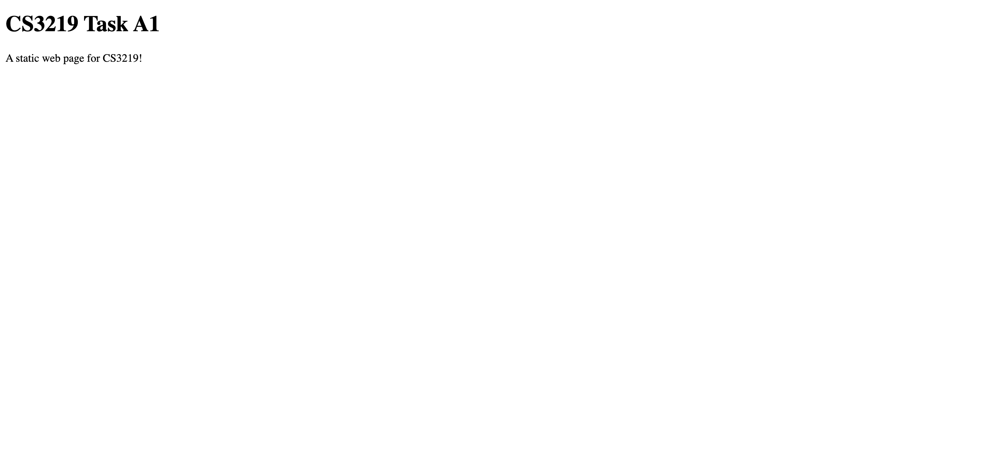

# CS3219 Task A1

## Student details

Name: Chow Jia Ying

Matriculation Number: A0187457M

## Github repository

The repository can be found at <https://github.com/C-likethis123/CS3219_A1>

## Instructions on how to run

### Prerequisites

Install Docker.

### Instructions

To build the Docker image: `docker build -t cs3219_a1 .`

To run the image: `docker run -dp 8080:8080 cs3219_a1`.

This starts a web server at localhost:8080.

Navigate to localhost:8080 and the following will be shown:

To stop the docker container, run `docker ps` to retrieve the container ID, then run `docker stop <container id>`

## Relevant Learnings and Solution writeup

### Docker

A Docker container image is a standalone executable that can run an application.

For this task, I have chosen to extend the [NGINX Docker image](https://hub.docker.com/_/nginx) in a Dockerfile and expose port 8080.

Relevant resources that I referred to:

- [NGINX Docker Image](https://hub.docker.com/_/nginx)
- [Dockerfile Reference](https://docs.docker.com/engine/reference/builder/)

### Nginx

Nginx is an open source reverse proxy server for protocols such as HTTP and HTTPS, and allows developers to build up load balancers and web servers.

For this solution I have a server at localhost:3000 which serves a static HTML file, as well as a proxy server at localhost:8080 which proxies requests to localhost:3000. More details can be found in the file `nginx.conf`.

Relevant resources that I referred to:

- [How to Configure a Nginx HTTPs Reverse Proxy on Ubuntu Bionic](https://www.scaleway.com/en/docs/how-to-configure-nginx-reverse-proxy/)
- [NGINX Reverse Proxy](https://docs.nginx.com/nginx/admin-guide/web-server/reverse-proxy/)
- [NGINX](https://www.nginx.com/resources/wiki/start/)
