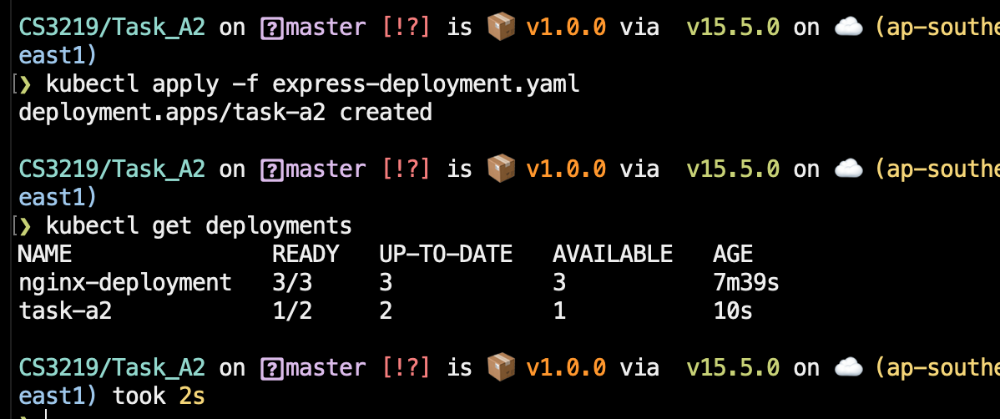

# Task A2

Student Name: Chow Jia Ying

Matriculation Number: A0187457M

Github link: [https://github.com/C-likethis123/CS3219/tree/master/Task_A2](https://github.com/C-likethis123/CS3219/tree/master/Task_A2)

## Setting up Kubernetes through Docker Desktop

To set up Kubernetes, I went to Docker Desktop -> Preference -> Kubernetes and enabled Kubernetes.

This installs the relevant images and runs a Kubernetes cluster.

I have also installed `kubectl` in my environment.

## Creating a sample image

To demonstrate, I have a simple Express server written in `index.js`. The `Dockerfile` packages `index.js` in a Docker image.

To build the Docker image: `docker build . -t clikethis123/task-a2:latest`

To run the Docker image locally: `docker run --name task-a2 --rm -d -p 3000:3000 clikethis123/task-a2`

To stop the Docker image locally: `docker stop task-a2`

Pushing the Docker image to Docker Hub: `docker push clikethis123/task-a2:latest`

## Deploying the app in Kubernetes

A Deployment has been set up with the relevant configurations in `express-deployment.yaml`.

To deploy the app, apply the configuration: `kubectl apply -f express-deployment.yaml`

The deployment will create two pods, one for each replica, as seen in the command `kubectl get pods`.

To create a service for the deployment: `kubectl apply -f express.service.yaml`. This creates a service named `task-a2` for the pods that are currently deployed.

`kubectl get svc task-a2` shows the following:

By accessing one of the pods and typing `curl <CLUSTER-IP>:<PORT>`, we can access the application.

To access the application in localhost, we can forward the port 3000 from the service to localhost like this:

`kubectl port-forward svc/task-a2 3000:3000`

And accessing it in `localhost:3000` should work.
